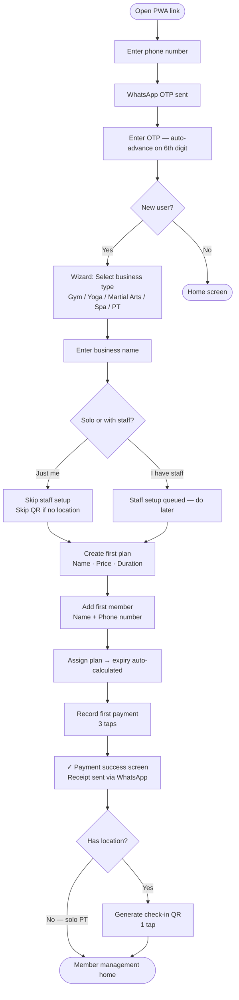
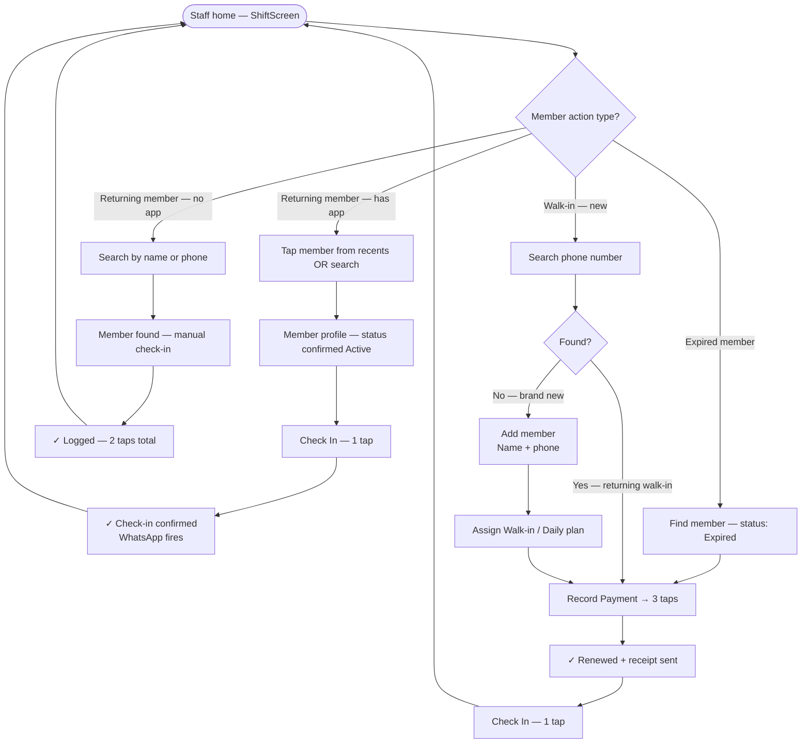
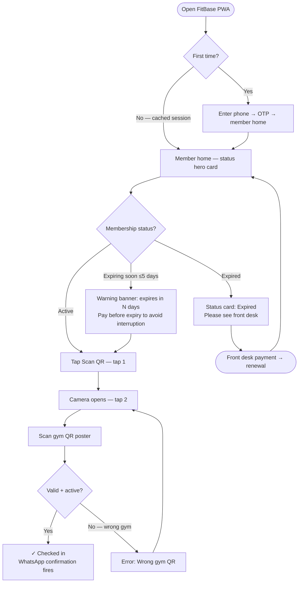
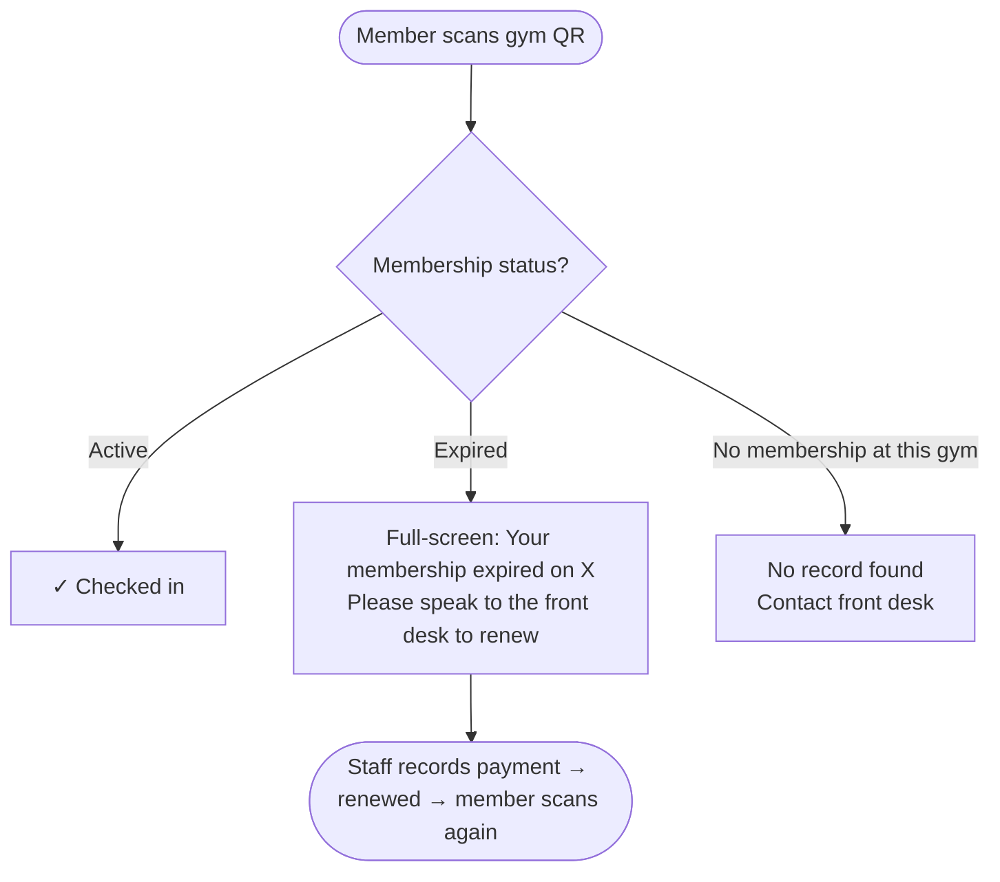
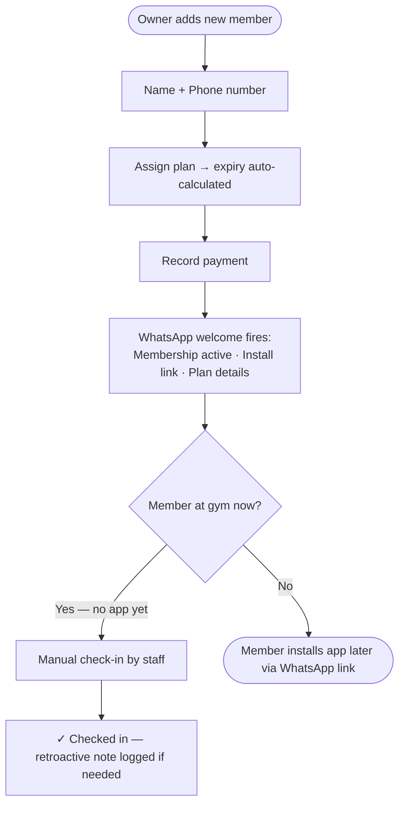
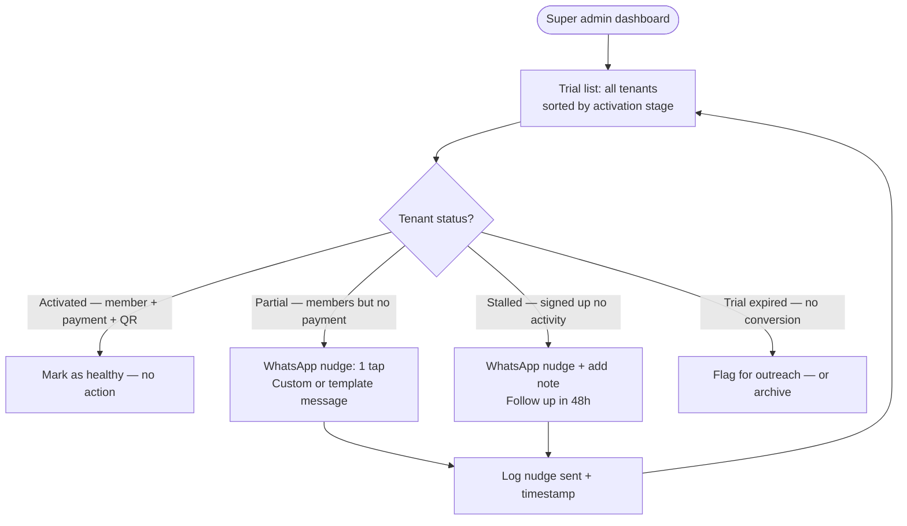
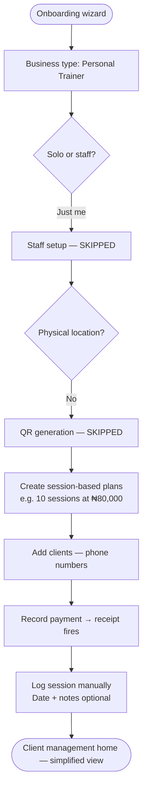

# UX Design Specification FitBase (GymOps)

**Author:** Adekunle
**Date:** 2026-04-12

---

## Executive Summary

### Project Vision

FitBase is a B2B2C SaaS PWA built from first principles for Nigerian fitness and wellness operators. It replaces WhatsApp group chats, exercise books, and Excel spreadsheets with a single offline-capable platform. The defining product moment: a gym owner logs a cash payment in 3 taps, an automated WhatsApp receipt reaches the member instantly, and the membership renews — all without manual effort. The real problem being solved is not "no software" but the absence of a shared source of truth between operators, staff, and members.

### Target Users

**Business Operator / Gym Owner** — Primary admin user, manages the business from their phone, often evenings after closing. Needs rapid setup (≤15 mins to first value), full member and payment visibility, and zero manual WhatsApp back-and-forth.

**Staff / Front Desk** — Operational user under time pressure, may use a shared device, needs to stay logged in. Core actions: search member, check in, record payment. Every extra tap costs them. The staff shift screen is the highest-frequency, highest-stakes surface in the product.

**Member / Client** — End consumer with self-service access to their own membership data. Needs proof their gym has their records right. Primary use case is at the gym (QR scan), not at home. Installs PWA for check-in and status visibility.

**Super Admin (Adekunle)** — Platform operator monitoring trial activation funnels and nudging stalled sign-ups.

### Key Design Challenges

1. **Dual-role PWA divergence** — Owner (admin, evenings, laptop-possible) vs. Staff (operational, shared phone, 7:30am rush) require fundamentally different interaction patterns within one app. Role routing happens post-auth — three distinct home screens, not one adaptive screen.
2. **3-tap payment constraint** — ≤3 taps is a hard product success metric, not aspirational. The payment flow must eliminate decision points via pre-configuration, smart defaults, and recents-first member surfacing.
3. **WhatsApp is the UX benchmark** — Users are not comparing FitBase to Mindbody. They are comparing it to muscle memory built on WhatsApp. Any screen that feels like a form has already lost. Design for one thing at a time.
4. **Offline sync legibility** — Users must trust that offline writes are safe and will sync. Sync state must be legible at a glance without technical literacy required.
5. **Multi-vertical terminology** — One data model must feel purpose-built for gyms, yoga studios, martial arts schools, spas, and personal trainers via a single `businessType` config step. Clear action verbs reduce terminology confusion.

### Design Opportunities

1. **WhatsApp receipt as trust artefact** — Visually confirm "Receipt sent ✓" on payment success to make the differentiation moment tangible.
2. **Member status as emotional dashboard** — A single green "Active · 14 days remaining" badge delivers more value than a feature-rich dashboard. Simplicity here is the design.
3. **Staff shift-mode UI** — Recents (last 5 members) + 3 action buttons + today-counter. Zero navigation overhead. Design this screen first — it is the daily product-market fit test.
4. **Scanner-as-home for members** — Open the app, already in QR scan mode. Status is one tap back. The gym floor is the primary context.
5. **Solo operator as first-class path** — Onboarding wizard detects "just me" + "no physical location" and removes all irrelevant UI, making the product feel purpose-built for personal trainers.

### Core Design Principles

1. **One screen, one decision** — no compound actions, no nested navigation
2. **WhatsApp is the benchmark, not SaaS** — if it feels like a form, redesign it
3. **Role context is set at login, not navigation** — the app knows who you are immediately
4. **Trust is visible** — every write confirms, every sync state is legible, every receipt shows "sent ✓"
5. **Recents over search** — surface what's most likely needed before the user asks

---

## Core User Experience

### Defining Experience

FitBase's core experience is built around a single defining loop: **staff records a payment in ≤3 taps → WhatsApp receipt fires automatically to the member → membership renews.** This loop happens dozens of times daily across all tenants and is the product's primary proof of value. Every other feature exists to support or extend this loop.

The three role-specific primary actions in frequency order:
- **Staff:** Record payment → Check in member → Find member
- **Owner:** View dashboard → Manage members → Review payments
- **Member:** Scan gym QR (check-in) → View membership status → View payment history

### Platform Strategy

- **Delivery:** Progressive Web App (PWA) — installable on Android Chrome (primary), iOS Safari (secondary)
- **Input model:** Touch-only; full-screen task flows with no persistent navigation chrome
- **Responsive target:** Mobile-first for all roles; owners may use tablet or laptop occasionally
- **Performance baseline:** ≤3 seconds to functional state on Tecno/Infinix mid-range Android over 3G
- **Hardware leverage:** Browser Camera API (html5-qrcode) for QR scanning; no native app required
- **Offline posture:** Online-first for MVP; architecture accommodates offline queue (IndexedDB + service worker) from day one, shipped as P2

### Effortless Interactions

These interactions must require zero thought — any friction here is a product failure:

| Interaction | Current State (WhatsApp + Excel) | FitBase Target |
|---|---|---|
| Recording a payment | 5–10 mins of WhatsApp back-and-forth + Excel update | ≤3 taps, receipt auto-fires |
| Checking in a returning member | Name in paper register + manual WhatsApp | Search → tap → done in 4 seconds |
| Looking up a member's status | "Let me check with the owner" | 3 seconds by name or phone number |
| Member proving membership is active | Awkward phone call or confrontation | Green self-service badge, no staff needed |
| New member onboarding | Multiple WhatsApp messages + manual Excel entry | Wizard → first receipt in ≤15 mins |

Automatic actions that require zero user intervention:
- WhatsApp receipt on payment recording
- Membership expiry auto-calculation from plan duration + start date
- Membership renewal on payment (no separate renewal step)
- Welcome WhatsApp with app install link on new member add
- Expiry reminder WhatsApp at configurable days before expiry

### Critical Success Moments

Five make-or-break interactions that determine whether FitBase earns or loses trust:

1. **The first WhatsApp receipt** — Tunde logs Emeka's payment and sees the receipt arrive on Emeka's phone in real time. This is the trial-to-paid conversion moment. It must be unmissable: a "Receipt sent ✓" confirmation on the payment success screen.

2. **Amaka's 7:30am shift** — 22 check-ins in 30 minutes on a shared phone. If the staff shift screen fails here — extra taps, slow search, unclear member status — the product fails its daily test. The shift screen is the highest-stakes surface in the product.

3. **Chidi's green badge** — First time a member opens the portal and sees "Active · 14 days remaining." The moment the gym's records become trustworthy to the member. Simplicity here is everything — no clutter above the fold.

4. **The expired member QR scan** — Clear, unambiguous message: "Your membership expired on 26 March 2026. Please speak to the front desk to renew." No confusion, no staff confrontation, no system ambiguity.

5. **The onboarding wizard completion** — Owner reaches QR generation without calling support, in a single solo session, in ≤15 minutes. The wizard must branch correctly for solo operators (skip staff + QR steps) and gym operators (full path).

### Experience Principles

1. **One screen, one decision** — No compound actions, no nested navigation. Every screen asks the user to do exactly one thing.
2. **WhatsApp is the benchmark, not SaaS** — If a flow feels like a form, redesign it. Users compare FitBase to muscle memory built on WhatsApp, not to Mindbody.
3. **Role context is set at login, not navigation** — Three distinct home screens (owner, staff, member). The app knows who you are immediately. No universal adaptive home screen.
4. **Trust is visible** — Every write confirms. Every sync state is legible at a glance. Every receipt shows "sent ✓". Nothing is silent.
5. **Recents over search** — Surface the last 5 members on the staff shift screen. The search input is the exception, not the rule.

---

## Desired Emotional Response

### Primary Emotional Goals

FitBase should shift users from their current emotional state to a distinctly better one:

- **Gym Owner:** Anxiety and distrust → **Calm authority.** He sees his business clearly, records are right, nothing is being lost silently.
- **Staff:** Exposure and blame → **Confident competence.** She can answer any question in seconds, protected by timestamped audit trails.
- **Member:** Distrust and helplessness → **Proof and autonomy.** His membership data is on his phone; he doesn't need to ask anyone.

### Emotional Journey Mapping

| Stage | User | Target Emotion |
|---|---|---|
| First discovery | Owner | Curious, hopeful — "someone solved this?" |
| OTP login in 8 seconds | Owner | Pleasantly surprised — "that was easy" |
| First WhatsApp receipt fires | Owner | Delight → Conviction — "this actually works" |
| Onboarding wizard complete | Owner | Accomplished, proud — "I did this myself" |
| Staff shift: 22 check-ins, zero register | Staff | Relieved, capable — "I've got this" |
| Member opens status badge | Member | Reassured, respected — "they have my records right" |
| Expired QR scan → clear message | Member | Informed, not humiliated — "at least I know" |
| Payment void with audit trail | Owner/Staff | Trusted, protected — "nothing is hidden" |
| Sync failure notification | All | Alert, not anxious — "I can see the problem" |

### Micro-Emotions

| Target Emotion | Avoid | Design Lever |
|---|---|---|
| **Confidence** | Confusion | Role-specific home screens; no irrelevant UI shown |
| **Trust** | Skepticism | Timestamps, staff attribution, "Receipt sent ✓" on every payment |
| **Accomplishment** | Frustration | ≤3 taps, auto-calculations, zero manual follow-up required |
| **Autonomy** | Helplessness | Member self-service status and full history, no staff needed |
| **Calm** | Anxiety | Explicit sync state indicator, no silent failures ever |
| **Delight** | Indifference | The WhatsApp receipt moment — celebrate it visually on the success screen |

### Design Implications

- **Trust is visible** — Payment success screen must show "Receipt sent ✓" prominently. Not a toast. Not a footnote. A confirmation that earns the moment.
- **Calm through clarity** — Sync state must be a persistent, legible indicator — not a modal alert, not buried in settings. A small but always-visible status that says "All synced" or "2 pending."
- **Accomplishment through speed** — The fewer decisions required, the more capable the user feels. Pre-filled defaults, smart recents, and auto-calculations are emotional design choices, not just UX conveniences.
- **Autonomy through transparency** — Members should never need to ask a staff member a question that FitBase can answer. The member portal is not a feature — it is a dignity affordance.
- **No humiliation on error** — Expired membership, failed payment, sync failure — all error states should inform without shame. Clear, factual, actionable. "Your membership expired on X" not "Access Denied."

### Emotional Design Principles

1. **Make the win visible** — When something goes right (payment recorded, receipt sent, check-in confirmed), celebrate it clearly. The user earned that moment.
2. **No silent anything** — Silence breeds anxiety. Every system action confirms. Every failure explains. Every sync state is named.
3. **Dignity on every screen** — Members are customers, not database entries. Staff are professionals, not data entry operators. Design language respects this at every touchpoint.
4. **Confidence through predictability** — The app behaves exactly the same way every time. No surprises in the core flow. Surprises are reserved for delight, never for errors.
5. **The first session sets the emotional contract** — If the onboarding wizard creates accomplishment and the first receipt creates delight, the user is emotionally committed. Everything after reinforces or erodes that contract.

---

## UX Pattern Analysis & Inspiration

### Inspiring Products Analysis

**WhatsApp — The Interaction Benchmark**

WhatsApp is not a competitor — it is the muscle memory FitBase must feel as familiar as. Nigerian gym operators run their businesses on it. Every UX decision should be validated against the question: "Does this feel as intuitive as sending a WhatsApp message?"

Key UX strengths:
- **Full-screen, single-context flows** — one conversation open at a time, no split views
- **Recents surface automatically** — most contacted people appear without searching
- **Bottom sheet for actions** — contextual, non-navigating
- **Instant confirmation** — single tick (sent), double tick (delivered), blue (read). Status is always visible.
- **Back = the only navigation** — no breadcrumbs, no sidebar, no persistent tab clutter mid-flow
- **Onboarding via phone number** — one field, OTP, in. No username, no password, no email

**PalmPay / OPay — The Fast Transaction Model**

The dominant Nigerian fintech super-apps. Staff and owners transfer money on these daily. They establish the Nigerian user's expectation of what "fast payment" looks and feels like on a mid-range Android.

Key UX strengths:
- **Transaction flow in 3–4 steps max** — amount, recipient, confirm, done. No detours.
- **Full-screen success state** — green animation, large confirmation number, share receipt CTA
- **Beneficiary recents on the home screen** — top row of recent contacts pre-loaded before any interaction
- **Bold, readable typography on low-res screens** — designed for Tecno/Infinix in poor lighting
- **Offline-tolerant UI** — shows cached balance, graceful pending states when network is slow

**Paystack Checkout — The Trust Signal**

Familiar to many Nigerian business owners. Sets the expectation for what a professional payment confirmation looks like in a Nigerian digital context.

Key UX strengths:
- **Single-screen checkout** — no multi-page wizard, everything visible at once
- **Green success animation** — instantly recognisable as "it worked"
- **Receipt sharing built in** — the success screen IS the receipt, shareable in one tap
- **Business branding visible** — "Paying IronCut Fitness" — the member knows exactly what they paid for

### Transferable UX Patterns

**Navigation Patterns:**
- **Back-only navigation (WhatsApp)** — no persistent sidebar or breadcrumb trail; full-screen task flows with a single back affordance. Apply to all staff and member flows in FitBase.
- **Recents-first home screen (PalmPay/WhatsApp)** — the last 5 recent members on the staff shift screen mirrors the beneficiary recents row. Staff should never start a shift by typing a search.
- **Role-based home routing (PalmPay)** — different home content for merchants vs. individuals. FitBase routes to 3 distinct home screens post-auth (owner, staff, member) — never one adaptive screen.

**Interaction Patterns:**
- **Bottom sheet for quick actions (WhatsApp)** — Record Payment slides up as a bottom sheet over the member profile. Preserves context, feels faster than a page navigation.
- **3–4 step transaction flow (PalmPay)** — Member (pre-selected) → Amount (pre-filled from plan) → Method (cash/transfer) → Confirm. Maximum 3 decision points.
- **Inline OTP auth (WhatsApp)** — Phone number → OTP input appears on the same screen → auto-advance on 6th digit. No page reload, no waiting state.

**Visual Patterns:**
- **Full-screen success state (PalmPay/Paystack)** — Payment success is a full-screen green moment. "Receipt sent ✓" is the hero content, not a toast notification.
- **Status badge as hero (Paystack)** — Member home screen: large status badge (green: Active / red: Expired), plan name, expiry date. Everything else is secondary.
- **Bold typography for noisy environments (PalmPay)** — Staff check-in screens and member status use large, high-contrast text readable in a gym with variable lighting.

### Anti-Patterns to Avoid

1. **The persistent sidebar nav** — Desktop pattern that fails on mobile. Adds a decision layer before every action. Use bottom nav (max 4 tabs for owner/member) or no nav (staff shift screen).
2. **Multi-field forms for core actions** — Recording a payment should never require filling out a form. If the screen has more than 2 input fields, redesign: pre-fill from context, use pickers not text inputs.
3. **Toast notifications for important confirmations** — A WhatsApp receipt firing is the product's most important moment. A 3-second toast does not earn that moment. Full-screen confirmation only.
4. **Dashboard-first design for staff** — Staff home = action home. Dashboard is one tap away for owners, not the default landing for staff.
5. **Generic error messages** — "Something went wrong. Try again." is an anxiety trigger. Every error must be specific: what failed, why (if known), what the user should do next.
6. **Requiring the member to have the app for core flows** — WhatsApp receipt delivers value to members who have never installed FitBase. The product must work for the gym even when members have zero app literacy.

### Design Inspiration Strategy

**Adopt directly:**
- Back-only navigation for all staff and member task flows (WhatsApp)
- Recents row on staff shift screen (PalmPay beneficiary model)
- Full-screen green success state for payment recording (PalmPay/Paystack)
- Phone + OTP auth with inline flow (WhatsApp)
- Bold, high-contrast typography for operational screens (PalmPay)

**Adapt for FitBase context:**
- WhatsApp's blue tick model → FitBase's "sent ✓ / pending / failed" sync state for offline writes
- PalmPay's 3-step transaction → FitBase's 3-tap payment (member pre-selected from recents, plan pre-filled, method toggle)
- Paystack's receipt card → FitBase's payment success screen (same trust signals, adds WhatsApp delivery confirmation)

**Avoid entirely:**
- Sidebar navigation
- Multi-field payment forms
- Dashboard-as-home for staff
- Toast-only confirmations for critical actions
- Generic error messaging

---

## Design System Foundation

### Design System Choice

**shadcn/ui + Tailwind CSS** — Themeable component system built on Radix UI primitives, fully owned by the project (components copied into codebase, not imported from a package).

This is already defined in the GymOps tech stack and is the correct choice for FitBase's constraints.

### Rationale for Selection

1. **Already in the stack** — No new tooling decision required. Next.js 15 + TypeScript + Tailwind + shadcn/ui is the defined foundation.
2. **Solo developer efficiency** — shadcn/ui provides production-ready, accessible components (Sheet, Dialog, Drawer, Button, Input, Badge, Tabs) that cover 90% of FitBase's UI needs without custom builds.
3. **Full ownership** — Components live in `src/components/ui/`. Customised once, owned forever. No upstream breaking changes.
4. **Radix UI primitives** — Keyboard navigation, focus management, ARIA attributes handled correctly out of the box. Critical for accessibility on mid-range Android devices.
5. **Tailwind for token flexibility** — Design tokens (colours, spacing, typography) defined in `tailwind.config.ts` and CSS variables. Brand customisation is a config change, not a component rewrite.
6. **Mobile-first by default** — Tailwind's responsive utilities and shadcn/ui's Drawer/Sheet components map directly to the bottom-sheet interaction patterns adopted from WhatsApp/PalmPay.

### Implementation Approach

**Core components needed for MVP:**

| Component | shadcn/ui primitive | FitBase use |
|---|---|---|
| Bottom sheet | `Drawer` (Vaul) | Payment recording, quick actions |
| Status badge | `Badge` | Member active/expired/expiring status |
| Search input | `Input` + `Command` | Member search on staff shift screen |
| Member card | Custom (built on `Card`) | Member list and recents |
| Success screen | Custom (built on `div` + Tailwind) | Full-screen payment success state |
| OTP input | `InputOTP` | Auth flow |
| QR display | Custom (built on `qrcode.react`) | Gym check-in QR code |
| Navigation | `Tabs` (bottom nav) | Owner and member role navigation |
| Alert/Error | `Alert` | Sync failure, expired membership |

**Custom components (not in shadcn/ui):**
- `MemberStatusCard` — hero status badge + plan + expiry on member home
- `ShiftScreen` — staff-specific layout: recents row + 3 action buttons + counter
- `SyncIndicator` — persistent sync state chip (synced / N pending / failed)
- `PaymentSuccessScreen` — full-screen green confirmation with "Receipt sent ✓"

### Customisation Strategy

**Design tokens (CSS variables in `globals.css`):**
- Primary green: active membership, success states, primary CTAs — warm Nigerian green, not clinical
- Alert red: expired membership, sync failures
- Neutral palette: dark text on light backgrounds for readability in gym lighting
- Typography scale: larger base size (16px minimum) for touch targets and variable conditions

**Brand application:**
- Business name and logo displayed on member-facing screens (member home, payment receipt)
- Each gym's identity visible without FitBase visual branding dominating — the gym is the brand; FitBase is the infrastructure

---

## Defining Experience

### The Core Interaction

**"Record a payment in 3 taps — the member gets a WhatsApp receipt before you put your phone down."**

This is the interaction users describe to other gym owners. It is the trial-to-paid conversion moment and the heartbeat of the product. Every other feature sets up or extends this loop.

### User Mental Model

**Current state (WhatsApp + Excel):** Payment recording is a multi-step, multi-app task — notebook entry, manual WhatsApp message, optional Excel update. 5–10 minutes, error-prone, produces unreliable records.

**FitBase target:** The payment screen IS the receipt. Confirm = done. The system handles the rest. Payment recording is one action that produces a reliable, permanent, automatic record.

**Confusion points resolved by design:**
- "Did the WhatsApp actually send?" → "Receipt sent ✓" as hero content on success screen
- "Did this update the membership?" → New expiry date shown on success screen
- "What if I'm offline?" → Sync indicator shows "1 pending" — no data lost, no confusion

### Success Criteria

The payment recording flow succeeds when:
1. Staff reaches payment confirmation in ≤3 taps from the member's profile
2. Success screen shows: member name, amount, new expiry date, "Receipt sent ✓" — without leaving the screen
3. Member receives WhatsApp receipt within 60 seconds
4. Staff can immediately proceed to next action (check in, find member) without multi-screen back navigation
5. Offline: "1 payment pending sync" displayed — no ambiguity, no data loss

### Pattern Analysis

The payment recording flow uses established patterns in an innovative combination — no novel interaction design, no user education required. The innovation is context: a payment flow designed for cash-dominant, mobile-only, Nigerian gym operators.

| Pattern | Source | FitBase application |
|---|---|---|
| Recents-first selection | PalmPay beneficiary row | Member pre-selected from recent list |
| Bottom sheet transaction | PalmPay / bank apps | Payment drawer slides up over member profile |
| Pre-filled amount from plan | Subscription billing UX | Plan price auto-populates; staff can override |
| Toggle for payment method | OPay transfer type | Cash / Bank Transfer — one tap to switch |
| Full-screen success state | PalmPay / Paystack | Green screen with receipt confirmation as hero |

### Experience Mechanics

**Initiation:** Staff opens member profile (from recents or search) → taps "Record Payment" primary CTA. Or: taps "Record Payment" from staff shift screen directly (member picker opens first).

**Interaction flow:**
- **Tap 1** — Member confirmed (pre-selected from profile, or selected from picker)
- **Tap 2** — Payment drawer slides up: plan name shown, amount pre-filled, method toggle (Cash / Bank Transfer), optional note (collapsed), "Record Payment" CTA
- **Tap 3** — "Record Payment" → loading state ("Sending receipt...") → success

**Feedback:**
- Full-screen green success state
- Hero: member name + amount paid + "Receipt sent ✓"
- Secondary: "Membership renewed · Valid until [date]"
- Tertiary: timestamp + staff attribution (audit trail, visible but not prominent)
- Offline variant: "Receipt will send when back online" replaces "Receipt sent ✓"

**Completion:**
- Two exit CTAs: "Check In [Member Name]" (primary next action) and "Done" (returns to shift screen)
- No back navigation — success screen is terminal

---

## Visual Design Foundation

### Color System

**Palette rationale:** Warm Nigerian green as primary — vibrant and trustworthy, not clinical. Deep charcoal neutrals over cold grays. Amber for warnings (expiring soon). Red for expired/error states. Off-white backgrounds that feel warm on OLED screens common in mid-range Nigerian devices.

**Primary — FitBase Green**

| Token | Value | Use |
|---|---|---|
| `--primary` | `#16A34A` (green-600) | Primary CTAs, active status badge, success states |
| `--primary-foreground` | `#FFFFFF` | Text on primary buttons |
| `--primary-light` | `#DCFCE7` (green-100) | Active status badge background, success screen tint |

**Semantic — Status Colours**

| Token | Value | Use |
|---|---|---|
| `--success` | `#16A34A` | Payment success, "Receipt sent ✓", active membership |
| `--warning` | `#D97706` (amber-600) | Expiring soon (≤7 days), pending sync |
| `--destructive` | `#DC2626` (red-600) | Expired membership, sync failed, void payment |
| `--warning-light` | `#FEF3C7` (amber-100) | Expiring soon badge background |
| `--destructive-light` | `#FEE2E2` (red-100) | Expired badge background |

**Neutral — Backgrounds & Text**

| Token | Value | Use |
|---|---|---|
| `--background` | `#FAFAF9` (warm stone-50) | App background — warm, not clinical white |
| `--foreground` | `#1C1917` (stone-900) | Primary text — deep warm charcoal |
| `--muted` | `#F5F5F4` (stone-100) | Card backgrounds, input fills |
| `--muted-foreground` | `#78716C` (stone-500) | Secondary text, labels, placeholders |
| `--border` | `#E7E5E4` (stone-200) | Dividers, card borders |
| `--card` | `#FFFFFF` | Card surface |

**Membership Status — At-a-glance badges**

| State | Background | Text | Border |
|---|---|---|---|
| Active | `#DCFCE7` | `#15803D` | `#86EFAC` |
| Expiring Soon | `#FEF3C7` | `#B45309` | `#FCD34D` |
| Expired | `#FEE2E2` | `#B91C1C` | `#FCA5A5` |

**Accessibility:** All colour combinations meet WCAG AA (4.5:1 minimum contrast ratio for normal text, 3:1 for large text and UI components). Primary green on white: 4.6:1 ✓. Foreground on background: 14.8:1 ✓.

### Typography System

**Font family:** `Inter` (ships with Next.js 15 via `next/font/google`) — clean, legible at all sizes, excellent rendering on Tecno/Infinix screens, widely familiar to Nigerian mobile users.

**Type scale (Tailwind classes):**

| Role | Size | Weight | Line height | Use |
|---|---|---|---|---|
| `display` | 28px / `text-2xl` | 700 | 1.2 | Payment amount on success screen |
| `h1` | 24px / `text-xl` | 700 | 1.3 | Screen titles (Member name on profile) |
| `h2` | 20px / `text-lg` | 600 | 1.4 | Section headings, card titles |
| `h3` | 16px / `text-base` | 600 | 1.5 | List item primary text, status badge label |
| `body` | 16px / `text-base` | 400 | 1.5 | All body content — 16px minimum |
| `body-sm` | 14px / `text-sm` | 400 | 1.5 | Secondary text, timestamps, labels |
| `caption` | 12px / `text-xs` | 400 | 1.4 | Audit trail attribution, helper text only |

**Key typographic decisions:**
- No text below 12px — mid-range Android screens, gym lighting
- Member names and amounts in `font-semibold` or `font-bold` — staff scan these at speed
- Status labels in `font-medium` uppercase — "ACTIVE", "EXPIRED", "EXPIRING SOON" — legible as badges
- Monetary amounts in `font-bold text-xl` — ₦35,000 should never be misread

### Spacing & Layout Foundation

**Base unit:** 8px (`space-2` in Tailwind) — standard, scales cleanly, Tailwind-native.

**Spacing scale in use:**

| Token | Value | Use |
|---|---|---|
| `space-1` / 4px | Micro gap | Icon-to-label, badge internal padding |
| `space-2` / 8px | Small gap | List item internal spacing |
| `space-3` / 12px | Default gap | Between related elements |
| `space-4` / 16px | Medium gap | Card padding, section spacing |
| `space-6` / 24px | Large gap | Between sections on a screen |
| `space-8` / 32px | XL gap | Screen-level padding, major section breaks |

**Touch targets:**
- Minimum 44×44px for all interactive elements (WCAG 2.5.5)
- Primary CTAs (Record Payment, Check In, Find Member): 56px height — generous for fast, inaccurate taps
- List items: 64px minimum height — tappable without precision

**Layout structure:**
- **Staff shift screen:** No tab bar. Full screen. Top: today-counter chip. Middle: 3 action buttons (56px each, full-width). Below: recents list (64px rows).
- **Owner home:** Bottom tab bar (4 tabs, 56px height). Full-width content above.
- **Member home:** Bottom tab bar (3 tabs). Hero card centred above fold.
- **Safe area:** Respect iOS bottom safe area (`pb-safe`) and Android navigation bar — critical for PWA full-screen mode.
- **Content max-width:** 480px centred on tablet/desktop — the app is mobile; wide screens get generous margins.

### Accessibility Considerations

- **Colour alone never conveys state** — Active/Expired badges use colour + text label + icon (● Active / ✕ Expired)
- **All interactive elements have visible focus states** — critical for keyboard users and screen readers
- **ARIA labels on icon-only buttons** — "Record Payment", "Check In", "Search" buttons with icons must have `aria-label`
- **Sync status announced to screen readers** — `aria-live="polite"` on the sync indicator chip
- **OTP input fields** — `autocomplete="one-time-code"` for automatic WhatsApp OTP fill on Android
- **Minimum touch target 44px** — enforced via Tailwind `min-h-[44px]` utility on all interactive elements
- **Reduced motion support** — success screen animation respects `prefers-reduced-motion`

---

## Design Direction Decision

### Design Directions Explored

Eight directions were generated and evaluated across all primary screens (see `ux-design-directions.html`):

| Direction | Screen | Approach |
|---|---|---|
| D1 | Staff shift home | Warm dark header, 3-action grid, recents list |
| D2 | Member status home | Full-bleed green hero, plan card |
| D3 | Staff shift (alt) | Full dark theme, search-first, pill actions |
| D4 | Payment recording | Member profile + bottom drawer, pre-filled |
| D5 | Payment success | Full-screen green, "Receipt sent ✓" hero |
| D6 | Member home (alt) | Warm card, days-remaining pill, quieter |
| D7 | Owner dashboard | Dark stats header, expiry alerts, 4-tab nav |
| D8 | Onboarding wizard | Progress bar, one-question-per-screen, option cards |

### Chosen Direction

**Screen-by-screen selection:**

| Screen | Direction | Rationale |
|---|---|---|
| Staff shift home | **D1** | Warm dark header is less jarring at 7:30am than full dark (D3); recents-first over search-first matches the recents-over-search principle |
| Member status home | **D2** | Full-bleed green hero delivers Chidi's emotional moment above the fold — "Active" status unmissable in one glance |
| Payment recording | **D4** | Fixed — bottom drawer over member profile is the only pattern that achieves ≤3 taps while preserving member context |
| Payment success | **D5** | Fixed — full-screen green is non-negotiable; the defining product moment must be full-screen |
| Owner dashboard | **D7** | Dark stats header gives Tunde instant business visibility; expiry alerts surface the silent-lapse problem directly |
| Onboarding wizard | **D8** | One-question-per-screen with option cards eliminates form anxiety; progress bar shows momentum |

### Design Rationale

- **D1 over D3 for staff:** The warm-dark header (stone-900) feels contextual without the full black-background dark mode, which can feel disconnected on mid-range Android screens with inconsistent dark mode rendering.
- **D2 over D6 for members:** The full-bleed green hero is the stronger emotional statement — Chidi's "green badge" moment needs to feel conclusive, not just informational. D6's warm card is quieter and more appropriate for a dashboard context within an owner view.
- **D4 and D5 are fixed patterns:** These are the core product loop. Variation here creates inconsistency in the most-repeated daily interaction.
- **D7 for owners:** The 4-stat dark header mirrors the PalmPay merchant home inspiration — owners think in numbers (members, revenue, check-ins, expiring). Expiry alerts directly address the ₦105,000/month silent-lapse problem identified in the PRD.
- **D8 for onboarding:** The solo operator detection step (D8 mockup) must feel decisive — option cards over dropdowns ensure the branch point is understood, not skimmed.

### Implementation Approach

Each chosen direction maps directly to a Next.js page/component:

| Direction | Route | Primary component |
|---|---|---|
| D1 — Staff shift | `/staff` | `ShiftScreen` (custom) |
| D2 — Member home | `/member` | `MemberStatusHero` (custom) |
| D4 — Payment drawer | Sheet over `/staff/member/[id]` | `PaymentDrawer` (shadcn Drawer) |
| D5 — Payment success | `/staff/payment/success` | `PaymentSuccessScreen` (custom) |
| D7 — Owner dashboard | `/dashboard` | `OwnerDashboard` + `ExpiryAlerts` |
| D8 — Onboarding | `/onboarding/[step]` | `WizardStep` (custom, shared layout) |

---

## User Journey Flows

### Journey 1: First-Run Onboarding (Tunde — Gym Owner)

**Goal:** Phone number → first WhatsApp receipt in ≤15 minutes.

**Entry point:** WhatsApp group link → opens PWA in browser.

**Tap count audit:** Phone entry (1) → OTP (auto) → Business type (1) → Business name (1) → Solo/staff (1) → Plan creation (3 fields) → Add member (2 fields) → Assign plan (1) → Record payment (3 taps) = ≤15 mins ✓

**Error paths:**
- OTP not received → "Resend via SMS" fallback (Termii)
- Phone already registered → route to login
- WhatsApp OTP delivery failure → automatic SMS fallback

---

### Journey 2: Staff Daily Shift (Amaka — Front Desk)

**Goal:** 22 check-ins in 30 minutes, zero register entries, zero manual WhatsApps.

**Entry point:** Staff shift screen (direct home after login).

**Stay-logged-in:** Toggle on first login for shared devices. No re-auth required during shift.

**Error paths:**
- Member not found → prompt to add new member
- Duplicate phone number → show existing member record
- Offline → check-in queued locally, sync indicator shows "1 pending"

---

### Journey 3: Member Self-Service Check-In (Chidi)

**Goal:** Door to gym floor in ≤8 seconds via QR scan.

**Entry point:** PWA icon on home screen (installed) or WhatsApp install link.

**2-tap guarantee:** Home screen → Scan QR (tap 1) → camera opens (tap 2) → auto-scan. No third tap required.

**Error paths:**
- Expired membership → clear message, route to front desk
- Camera permission denied → prompt to grant, fallback instructions
- QR scan fails (poor lighting) → manual entry fallback with gym code

---

### Journey 4: Edge Cases

#### 4a — Lapsed Member QR Scan

#### 4b — New Member Added by Owner (Ngozi)

---

### Journey 5: Super Admin — Trial Monitoring (Adekunle)

**Goal:** Identify stalled trials and nudge to activation.

**Activation funnel stages (tracked per tenant):**
1. Signed up
2. Business profile complete
3. First member added
4. First payment recorded
5. QR generated

---

### Journey 6: Solo Personal Trainer (Biodun)

**Goal:** Member + payment management without location or staff overhead.

**UI adaptation:** No "Check In" tab visible. No QR section in settings. "Check In" replaced with "Log Session." Terminology: "Client" not "Member."

---

### Journey Patterns

**Navigation patterns:**
- **Back = the only exit** — all task flows entered and exited via back or terminal success screen. No mid-flow navigation.
- **Role home is always 1 back from any screen** — one back brings staff to ShiftScreen, members to StatusHero, owners to Dashboard.
- **Recents-first before search** — staff shift screen surfaces last 5 members; search is secondary.

**Decision patterns:**
- **Branch at onboarding, not at runtime** — solo/staff and location decisions made once during wizard.
- **Status-first member display** — every member row shows status badge before name context.
- **Pre-filled defaults at every form** — plan price, today's date, last payment method. Staff override only when needed.

**Feedback patterns:**
- **Immediate optimistic UI** — check-in and payment UIs confirm instantly; sync happens in background.
- **Full-screen for terminal success** — payment success and check-in confirmation get full-screen treatment, not toasts.
- **Inline error in context** — expired membership shown on member profile, not as a modal interrupting flow.
- **Sync state always visible** — persistent chip on all staff and owner screens.

### Flow Optimisation Principles

1. **Eliminate the return trip** — after recording a payment, "Check In [Name]" is the primary CTA. Staff never navigate back to find the member they just paid.
2. **Zero dead ends** — every error state has a recovery action. "Expired" → see front desk. "Not found" → add member. "Sync failed" → retry.
3. **Offline = same UX, different indicator** — the flow is identical offline. Only the sync indicator changes.
4. **Wizard branching is invisible** — Biodun never sees a "QR generation — SKIPPED" message. The wizard simply doesn't show that step.
5. **WhatsApp as the parallel track** — every key event fires a WhatsApp. Members who never install the PWA are still served.

---

## Component Strategy

### Design System Components (shadcn/ui — Available Now)

| Component | shadcn/ui primitive | FitBase use |
|---|---|---|
| `Button` | `Button` | All CTAs — primary (green), outline, ghost |
| `Input` | `Input` | Phone number entry, member search, payment amount |
| `InputOTP` | `InputOTP` | Auth OTP entry — 6 digits, auto-advance |
| `Drawer` | `Drawer` (Vaul) | Payment recording bottom sheet, quick actions |
| `Sheet` | `Sheet` | Secondary drawers (add member, add plan) |
| `Badge` | `Badge` | Membership status chips (Active / Expiring / Expired) |
| `Card` | `Card` | Dashboard stat cards, member list rows |
| `Alert` | `Alert` | Sync failure notification, expiry warning banner |
| `Tabs` | `Tabs` | Bottom navigation (owner 4-tab, member 3-tab) |
| `Dialog` | `Dialog` | Confirmation modals (void payment, remove staff) |
| `Select` | `Select` | Plan selection, business type selection |
| `Switch` | `Switch` | Stay logged-in toggle, notification preferences |
| `Separator` | `Separator` | Section dividers in forms and lists |
| `Skeleton` | `Skeleton` | Loading states for member list, dashboard stats |
| `Sonner` | `Sonner` | Non-critical toasts only (not for payment success) |
| `Avatar` | `Avatar` | Member initials avatar in list rows |

### Custom Components

#### `ShiftScreen`

**Purpose:** Staff-only home screen — the highest-stakes surface in the product.

**Anatomy:**
- Top bar: business name (left) + sync indicator chip (right)
- Counter row: "N check-ins today" pill — green
- Action grid: 3 equal-width cards — Record Payment (primary/green), Check In, Find Member
- Recents section label: "Recent" — muted uppercase
- Recent member list: up to 5 rows — avatar, name, status badge, plan expiry

**States:** `default`, `empty` (new gym — prompt to add first member), `offline` (amber sync indicator, all actions functional), `loading` (skeleton rows)

**Accessibility:** `role="main"`, action buttons have `aria-label`, sync chip has `aria-live="polite"`.

---

#### `MemberStatusHero`

**Purpose:** Member home screen hero — the "green badge" moment for Chidi.

**Anatomy:**
- Full-bleed coloured header (green/amber/red by status)
- Gym name, member name, status badge, plan card (name + expiry)
- Below fold: quick stats (last check-in, last payment, monthly count)

**States:** `active` (green), `expiring` (amber + days remaining), `expired` (red + "See front desk"), `loading` (skeleton)

**Variants:** `member-view` (with QR scan CTA) | `owner-member-view` (with edit/payment buttons)

**Accessibility:** Status conveyed via colour + text + icon. `aria-label` includes full text ("Membership active, 14 days remaining").

---

#### `PaymentSuccessScreen`

**Purpose:** Terminal success state for payment recording — the defining product moment.

**Anatomy:**
- Full-screen green background
- Check circle (72px white), "Payment Recorded" title, amount (display size), member + plan
- "Receipt sent via WhatsApp 📱" pill
- Receipt summary card (renewed, new expiry, staff attribution)
- CTAs: "Check In [Name]" (primary) + "Done" (ghost)

**States:** `receipt-sent` (default), `receipt-pending` (offline — "will send when back online"), `receipt-failed` (retry CTA)

**Accessibility:** `role="status"`, `aria-live="assertive"`. Focus moves to "Check In" CTA on mount. Respects `prefers-reduced-motion`.

---

#### `SyncIndicator`

**Purpose:** Persistent sync state chip on all staff/owner screens — the "no silent anything" principle made tangible.

**States:** `synced` (green dot, fades after confirm), `pending` (amber dot + "N pending"), `failed` (red dot + "Sync failed" — tappable to retry), `offline` (grey dot + "Offline")

**Variants:** `compact` (dot only) | `full` (dot + text, default)

**Accessibility:** `aria-live="polite"`, `role="status"`.

### Component Implementation Strategy

All custom components live in `src/components/fitbase/`. All use Tailwind CSS variables — no hardcoded colours. All export TypeScript props interfaces. All pass `className` prop for layout overrides.

### Implementation Roadmap

**Phase 1 — P0:**

| Component | Needed for |
|---|---|
| `ShiftScreen` | Staff daily ops |
| `PaymentSuccessScreen` | Payment recording |
| `SyncIndicator` | All staff/owner screens |
| shadcn `InputOTP` | Auth OTP flow |
| shadcn `Drawer` | Payment bottom sheet |
| shadcn `Badge` | Member status everywhere |

**Phase 2 — P1:**

| Component | Needed for |
|---|---|
| `MemberStatusHero` | Member home screen |
| shadcn `Tabs` | Owner + member bottom nav |
| shadcn `Card` | Owner dashboard stats |
| shadcn `Alert` | Expiry alerts |

**Phase 3 — P2:**

| Component | Needed for |
|---|---|
| `SyncIndicator` offline states | Offline-first |
| shadcn `Skeleton` | Loading/sync states |
| Super admin tenant card | Super admin dashboard |

---

## UX Consistency Patterns

### Button Hierarchy

Every screen has at most one primary CTA. The hierarchy is enforced strictly.

| Level | Variant | Use | Example |
|---|---|---|---|
| **Primary** | `btn-primary` — green, full-width, 56px | The one thing we want the user to do | "Record Payment", "Check In", "Continue →" |
| **Secondary** | `btn-outline` — border, full-width, 48px | A valid but less preferred action | "Done", "Skip for now" |
| **Ghost** | `btn-ghost` — no border, text only | Low-priority exit | "Cancel" |
| **Destructive** | `btn-destructive` — red, full-width | Irreversible actions requiring intent | "Void with reason" (inside confirmation dialog only) |
| **Icon** | `btn-icon` — 44×44px square | Single-purpose icon actions in list rows | Edit member, back navigation |

**Rules:**
- Never more than one primary button per screen
- Destructive buttons only appear inside confirmation dialogs — never as a direct first-tap action
- Full-width buttons on mobile (screen width minus 32px padding)
- All buttons minimum 44px height (WCAG 2.5.5)

### Feedback Patterns

**Success — Full-screen (terminal actions):** `PaymentSuccessScreen` only. For payment recording and membership renewal. Never a toast.

**Success — Inline (non-terminal):** Green `Alert` with check icon. For: check-in confirmed, member added, plan created.

**Error — Inline in context:** Red `Alert` at top of relevant form/section. Specific text: "Phone number already registered — [view member]" not "An error occurred." Never a modal unless the error blocks all progress.

**Warning — Banner:** Amber `Alert` below top bar. For: membership expiring soon, sync pending, trial expiring.

**Sync state — `SyncIndicator` (persistent):**
- `● All synced` (green) — fades to minimal dot after 3 seconds
- `⏳ N pending` (amber) — persists until synced
- `✕ Sync failed` (red) — persists until resolved; tappable to retry

**Loading:** `Skeleton` components for lists and stat cards. Full-screen spinners only for auth/OTP (≤2 seconds). Never block entire UI for background operations.

### Form Patterns

- **One field group per wizard step** — never more than 2 input fields per onboarding screen
- **Pre-fill everything possible** — payment amount from plan, date from today, method from last used
- **Validate on submit, not on blur** — exception: phone number format after typing complete
- **Mark optional fields** with "(optional)" — not required fields with asterisk
- **Numeric inputs:** `inputmode="numeric"` — never `type="number"` (Naira formatting issues)
- **Phone number:** `type="tel"`, `autocomplete="tel"`, "+234" as static prefix, user types 10 digits

### Navigation Patterns

**Bottom tabs by role:**
- Owner: Dashboard / Members / Payments / Settings (4 tabs)
- Member: Status / Check In / History (3 tabs)
- Staff: No tab bar — `ShiftScreen` is the only home

**Back navigation:** Single `←` top-left on all non-home screens. Always returns to immediate parent — never cross-section.

**Bottom drawers:** Quick actions that don't warrant a full screen (payment recording, add member, QR display). Max 85vh. Dismissable by drag or back.

**Deep link protection:** Unauthenticated deep links redirect to login with return URL preserved.

### Modal & Overlay Patterns

- **Confirmation dialogs:** Irreversible actions only (void payment, remove staff, archive member). Title states action, body explains consequence, destructive primary + cancel ghost.
- **Bottom drawers:** Quick forms — max 85vh, drag handle, dismissable.
- **Full-screen overlays:** `PaymentSuccessScreen` only. No dismiss mechanism — intentional.

### Empty State Patterns

| Screen | Message | CTA |
|---|---|---|
| Member list | "No members yet. Add your first member to get started." | "Add Member" |
| Staff shift recents | "No recent activity. Search for a member to begin." | Search focused |
| Payment history | "No payments recorded yet." | "Record First Payment" |
| Owner dashboard (0 members) | "Your gym has no active members. Start by adding a member." | "Add Member" |

Empty states: muted icon (48px) + one-line message + optional CTA. Never "No data available."

### Search & Filter Patterns

- **Member search:** Single input, results after 2 characters (200ms debounce), search by name or phone, no-results state prompts "Add as new member?"
- **List filter:** Tab-style chips above list (All / Active / Expiring / Expired). No filter modal for MVP.
- **No separate search button** — results update on keystroke.

### Offline State Patterns

**Principle:** Offline is a normal operating mode, not an error state.

- All reads served from cache; all writes queued in IndexedDB
- Success screens show "Receipt will send when back online" — same UX, different indicator
- On reconnect: sync auto-runs, `SyncIndicator` updates to "All synced"
- No disruptive modal or full-screen offline banner
- Server is authoritative on conflict — user notified inline, never silently overwritten

---

## Responsive Design & Accessibility

### Responsive Strategy

FitBase is a **mobile-first PWA**. Mobile is the primary platform for all three roles. No role requires desktop as a primary interface.

**Mobile (primary — 320px–767px):** The design target. All layouts, touch targets, typography, and interaction patterns designed for this range first. Android mid-range (360px–390px viewport) is the specific test target — Tecno Spark, Infinix Hot, Samsung A-series.

**Tablet (secondary — 768px–1023px):** Owners may occasionally access on tablet. Layout adapts to show more content density — wider cards, optional side-by-side form layout — but no fundamental interaction model change. Still touch-first.

**Desktop (tertiary — 1024px+):** Content centres at max-width 480px with generous side margins. The app is letterboxed with comfortable whitespace — functional but not optimised. No desktop-specific features in MVP.

### Breakpoint Strategy

**Mobile-first Tailwind breakpoints:**

| Breakpoint | Min-width | Use |
|---|---|---|
| (default) | 0px | All mobile layouts — primary target |
| `sm` | 640px | Minor adjustments — wider padding, slightly larger text |
| `md` | 768px | Tablet adaptations — wider cards, side-by-side form fields |
| `lg` | 1024px | Desktop centring — `max-w-[480px] mx-auto` on app shell |

`xl` and `2xl` not used in MVP — no desktop-optimised layouts.

### Accessibility Strategy

**Target compliance: WCAG 2.1 Level AA**

**Priority requirements for FitBase's specific context:**

1. **Touch targets (WCAG 2.5.5)** — Minimum 44×44px enforced via `min-h-[44px]`. Staff action buttons: 56px. Critical for gym environments (shared devices, sweaty hands).
2. **Colour contrast (WCAG 1.4.3)** — Foreground/background: 14.8:1 ✓. Primary green/white: 4.6:1 ✓. All body text meets 4.5:1 minimum.
3. **Status not by colour alone (WCAG 1.4.1)** — All status badges: colour + text + icon. Sync indicator: colour + text.
4. **Screen reader support (WCAG 4.1.2)** — Semantic HTML, `aria-label` on icon-only buttons, `aria-live="polite"` on dynamic updates, `aria-live="assertive"` on payment success.
5. **Focus management (WCAG 2.4.3)** — Visible focus ring (`focus-visible:ring-2`), focus moves to drawer first element on open, returns to trigger on close.
6. **OTP autocomplete** — `autocomplete="one-time-code"` enables Android automatic OTP fill from WhatsApp.
7. **Reduced motion** — Success screen animation wrapped in `prefers-reduced-motion: no-preference` media query.

### Testing Strategy

**Responsive testing:**

| Test | Target | Tool |
|---|---|---|
| Device simulation | Tecno Spark (360×800), Infinix Hot (390×844) | Chrome DevTools |
| Real device | Android 10–13, Tecno/Samsung A-series | Physical / BrowserStack |
| PWA installability | Android Chrome Add to Home Screen | Lighthouse PWA audit |
| Network throttling | Slow 3G | Chrome DevTools |

**Accessibility testing:**

| Test | Tool |
|---|---|
| Automated a11y scan | `axe-core` in Jest + Playwright |
| Colour contrast | Colour Contrast Analyser |
| Screen reader | TalkBack (Android, primary) + VoiceOver (iOS, secondary) |
| Keyboard navigation | Manual tab-through all flows |

**Performance targets:**

| Metric | Target |
|---|---|
| Time to functional (3G) | ≤3 seconds |
| Subsequent load (cached) | ≤1 second |
| Payment confirm to success | ≤500ms |
| Member search response | ≤300ms |

### Implementation Guidelines

**Responsive:**
- Tailwind mobile-first utilities — base styles target mobile, `md:` and `lg:` for wider screens
- Use `dvh` not `vh` for full-screen layouts (avoids iOS Safari toolbar overlap)
- `safe-area-inset` padding on bottom nav and drawers: `pb-[env(safe-area-inset-bottom)]`
- `next/image` with `sizes` prop; WebP format; `aspect-ratio` preserved to prevent layout shift
- `next/font` with `display: swap` for Inter

**Accessibility:**
- Every icon-only `<button>` gets `aria-label`
- Every `<input>` gets an associated `<label>` — never `placeholder` as label substitute
- Error messages reference their input with `aria-describedby`
- Page titles update on route change via Next.js `metadata` API
- Skip link: "Skip to main content" as first focusable element (visible on focus)
- No `tabindex` values above 0 — natural DOM order is tab order
